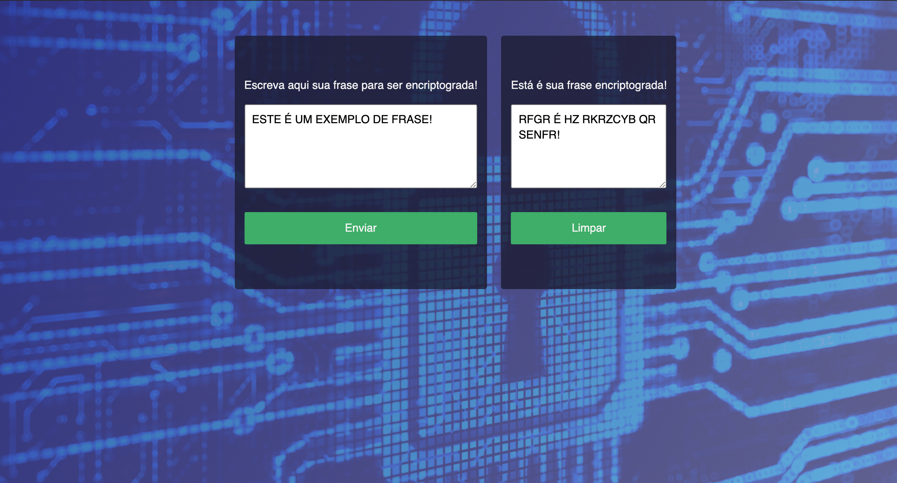

# CaesarsCipher

## Projeto baseado na Cifra de Cesar modelo **ROT13**. 

_Neste modelo, o alfabeto é deslocado 13 vezes. Como o nosso alfabeto possui 26 letras,
o ROT13 possui a propriedade de que o mesmo algoritmo usado para encripitar a mensagem é usado para decriptar._

